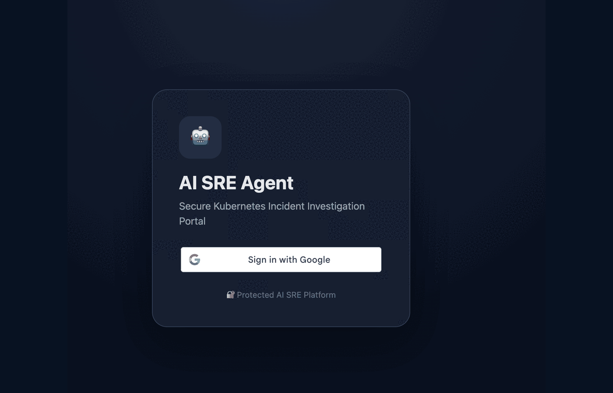

# 🤖 AI SRE Agent on GKE

AI-assisted Kubernetes incident investigation and remediation platform built on **Google Kubernetes Engine (GKE)** using **FastAPI, Prometheus, Grafana, Google IAP, Kubernetes APIs, and policy-controlled remediation**.

The project is designed to reduce repetitive Kubernetes troubleshooting work by collecting operational evidence, analyzing workload health, surfacing likely root causes, and recommending controlled remediation actions.

---

## 🎥 Demo

<p align="center">
  
</p>

The demo covers the end-to-end flow:

```text
Google IAP Authentication
        ↓
AI SRE Dashboard
        ↓
Platform Health
        ↓
Monitoring
        ↓
Incident Investigation
        ↓
Namespace / Deployment Selection
        ↓
Root Cause Analysis
        ↓
Recommended Remediation
```

---

## 🚀 What This Project Does

A normal Kubernetes incident often means switching between several tools:

```text
Alert
  ↓
kubectl get pods
  ↓
kubectl describe pod
  ↓
kubectl logs
  ↓
kubectl get events
  ↓
Prometheus
  ↓
Grafana
  ↓
Manual Correlation
  ↓
Root Cause Analysis
```

This project brings those signals into one investigation workflow.

Example questions:

```text
Why is payment-api crashing?
Show unhealthy pods
Check recent errors
Which containers are restarting frequently?
```

The platform gathers Kubernetes context and presents a structured investigation result.

---

## ✨ Features

* Kubernetes workload investigation
* Dynamic namespace discovery
* Dynamic deployment discovery
* Pod health analysis
* Container restart analysis
* Kubernetes event inspection
* Prometheus integration
* Grafana integration
* Platform health dashboard
* Incident investigation interface
* Root-cause oriented output
* Google Identity-Aware Proxy protection
* Google Cloud IAM authorization
* GKE Ingress
* Google Managed HTTPS
* Kubernetes RBAC
* Human-in-the-loop remediation
* Policy-controlled auto-healing
* Sample failure workloads for testing

---

## 🏗️ Architecture

```text
                           User
                            │
                            ▼
                   https://<YOUR_DOMAIN>
                            │
                            ▼
                Google HTTPS Load Balancer
                            │
                            ▼
                 Identity-Aware Proxy
                            │
                            ▼
                    IAM Authorization
                            │
                            ▼
                       GKE Ingress
                            │
                            ▼
                  ai-sre-agent Service
                            │
                            ▼
                     FastAPI Backend
                            │
              ┌─────────────┼─────────────┐
              │             │             │
              ▼             ▼             ▼
         Kubernetes      Prometheus      Grafana
              │             │             │
              └─────────────┼─────────────┘
                            │
                            ▼
                    Incident Analysis
                            │
                            ▼
                   Root Cause Analysis
                            │
                            ▼
                Recommended Remediation
                            │
                            ▼
                Policy-Controlled Action
```

---

## 🧰 Technology Stack

| Component              | Technology                  |
| ---------------------- | --------------------------- |
| Backend                | FastAPI                     |
| Frontend               | HTML, CSS, JavaScript       |
| Kubernetes             | Google Kubernetes Engine    |
| Container Runtime      | Docker                      |
| Monitoring             | Prometheus                  |
| Visualization          | Grafana                     |
| Authentication         | Google Identity-Aware Proxy |
| Authorization          | Google Cloud IAM            |
| HTTPS                  | Google Managed Certificate  |
| Load Balancing         | GKE Ingress                 |
| Registry               | Google Artifact Registry    |
| Kubernetes Integration | Kubernetes Python Client    |
| Cluster Security       | Kubernetes RBAC             |

---

## 📁 Repository Structure

```text
ai-sre-agent-gke/
├── app/
│   ├── __init__.py
│   ├── agent.py
│   ├── main.py
│   ├── remediation/
│   │   ├── __init__.py
│   │   ├── executor.py
│   │   ├── planner.py
│   │   ├── policies.py
│   │   └── verifier.py
│   ├── static/
│   │   ├── app.js
│   │   └── style.css
│   ├── templates/
│   │   ├── index.html
│   │   └── login.html
│   └── tools/
│       ├── __init__.py
│       └── kubernetes_tools.py
│
├── docs/
│   └── demo/
│       ├── ai-sre-demo.gif
│       ├── iap.png
│       ├── investigate.png
│       ├── login.png
│       ├── monitoring.png
│       ├── overview.png
│       ├── result-1.png
│       └── result-2.png
│
├── incident-app/
│   ├── crashloop-demo.yaml
│   ├── imagepull-demo.yaml
│   ├── payment-api-crash.yaml
│   └── pending-demo.yaml
│
├── k8s/
│   ├── ai-sre-agent-deployment.yaml
│   ├── ai-sre-agent-service.yaml
│   ├── ai-sre-backendconfig.yaml
│   ├── ai-sre-ingress.yaml
│   ├── managed-certificate.yaml
│   ├── rbac.yaml
│   └── serviceaccount.yaml
│
├── monitoring/
│   └── prometheus-values.yaml
│
├── .dockerignore
├── .gitignore
├── Dockerfile
├── LICENSE
├── README.md
└── requirements.txt
```

---

## ✅ Prerequisites

You will need:

* Google Cloud project
* GKE cluster
* Artifact Registry repository
* `gcloud`
* `kubectl`
* Docker
* Helm
* Python 3
* DNS hostname
* Google OAuth client for IAP
* Prometheus and Grafana

Authenticate:

```bash
gcloud auth login
```

Set your project:

```bash
gcloud config set project <PROJECT_ID>
```

Verify cluster access:

```bash
kubectl get nodes
```

---

## 🐳 Build the Container Image

If you are building from an Apple Silicon Mac and your GKE nodes use AMD64:

```bash
docker buildx build \
  --platform linux/amd64 \
  -t <REGION>-docker.pkg.dev/<PROJECT_ID>/<REPOSITORY>/ai-sre-agent:v1 \
  --push .
```

---

## ☸️ Deploy to GKE

Apply the ServiceAccount:

```bash
kubectl apply -f k8s/serviceaccount.yaml
```

Apply RBAC:

```bash
kubectl apply -f k8s/rbac.yaml
```

Deploy the application:

```bash
kubectl apply -f k8s/ai-sre-agent-deployment.yaml
```

Apply the Service:

```bash
kubectl apply -f k8s/ai-sre-agent-service.yaml
```

Check status:

```bash
kubectl get pods -n ai-sre
kubectl get svc -n ai-sre
```

Restart when required:

```bash
kubectl rollout restart deployment ai-sre-agent -n ai-sre
kubectl rollout status deployment ai-sre-agent -n ai-sre
```

---

## 🔐 Kubernetes RBAC

The AI SRE Agent uses a dedicated Kubernetes ServiceAccount.

Verify the ServiceAccount used by the deployment:

```bash
kubectl get deployment ai-sre-agent \
  -n ai-sre \
  -o jsonpath='{.spec.template.spec.serviceAccountName}'
echo
```

Verify in-cluster Kubernetes access:

```bash
kubectl exec -n ai-sre deployment/ai-sre-agent -- \
  python -c '
from kubernetes import client, config
config.load_incluster_config()
v1 = client.CoreV1Api()
print([n.metadata.name for n in v1.list_namespace().items])
'
```

Typical read permissions include:

```text
namespaces
pods
pods/log
events
services
endpoints
deployments
replicasets
```

Write permissions should be limited to explicitly approved remediation actions.

---

## 📊 Prometheus and Grafana

This project uses the open-source `kube-prometheus-stack`.

Add the Helm repository:

```bash
helm repo add prometheus-community \
  https://prometheus-community.github.io/helm-charts
```

Update:

```bash
helm repo update
```

Create the monitoring namespace:

```bash
kubectl create namespace monitoring
```

Install:

```bash
helm install monitoring \
  prometheus-community/kube-prometheus-stack \
  -n monitoring \
  -f monitoring/prometheus-values.yaml
```

Check services:

```bash
kubectl get svc -n monitoring
```

Example internal Prometheus endpoint:

```text
http://monitoring-kube-prometheus-prometheus.monitoring.svc.cluster.local:9090
```

---

## 🔎 Incident Investigation

The investigation flow allows an engineer to:

1. Select a namespace
2. Select a deployment
3. Enter an investigation question
4. Collect Kubernetes evidence
5. Review the generated analysis
6. Review remediation recommendations

Example questions:

```text
Why is payment-api crashing?
Show unhealthy pods
Check recent errors
```

The workflow can inspect:

```text
Pod state
Container state
Restart count
Readiness
Kubernetes events
Deployment state
```

---

## 🧪 Sample Incidents

Sample workloads are included under:

```text
incident-app/
```

Examples:

```text
crashloop-demo.yaml
imagepull-demo.yaml
payment-api-crash.yaml
pending-demo.yaml
```

Deploy one:

```bash
kubectl apply -f incident-app/payment-api-crash.yaml
```

Check:

```bash
kubectl get pods -n ai-sre
```

These manifests help reproduce common failure scenarios such as:

```text
CrashLoopBackOff
ImagePullBackOff
Pending
```

---

## 🌐 GKE Ingress

Apply the Ingress:

```bash
kubectl apply -f k8s/ai-sre-ingress.yaml
```

Check:

```bash
kubectl describe ingress ai-sre-ingress -n ai-sre
```

Traffic path:

```text
Internet
  ↓
Google HTTPS Load Balancer
  ↓
GKE Ingress
  ↓
ClusterIP Service
  ↓
FastAPI Pod
```

---

## 📍 Global Static IP

Create:

```bash
gcloud compute addresses create ai-sre-static-ip \
  --global
```

Retrieve:

```bash
gcloud compute addresses describe ai-sre-static-ip \
  --global \
  --format="get(address)"
```

Point your DNS record to this IP.

---

## 🔒 HTTPS with Google Managed Certificate

Example:

```yaml
apiVersion: networking.gke.io/v1
kind: ManagedCertificate
metadata:
  name: ai-sre-cert
  namespace: ai-sre
spec:
  domains:
    - <YOUR_DOMAIN>
```

Apply:

```bash
kubectl apply -f k8s/managed-certificate.yaml
```

Check:

```bash
kubectl describe managedcertificate ai-sre-cert -n ai-sre
```

Wait for:

```text
CertificateStatus: Active
```

---

## 🛡️ Google Identity-Aware Proxy

The portal is protected using Google Cloud IAP.

```text
Internet
  ↓
HTTPS Load Balancer
  ↓
Google IAP
  ↓
IAM Authorization
  ↓
GKE Backend
```

Example BackendConfig:

```yaml
apiVersion: cloud.google.com/v1
kind: BackendConfig
metadata:
  name: ai-sre-backendconfig
  namespace: ai-sre
spec:
  iap:
    enabled: true
    oauthclientCredentials:
      secretName: ai-sre-auth
```

Apply:

```bash
kubectl apply -f k8s/ai-sre-backendconfig.yaml
```

List GKE-created backend services:

```bash
gcloud compute backend-services list --global
```

---

## 🔑 OAuth Credentials

Do **not** commit OAuth credentials to GitHub.

Create or patch the Kubernetes Secret at deployment time:

```bash
kubectl patch secret ai-sre-auth \
  -n ai-sre \
  --type merge \
  -p='{
    "stringData": {
      "client_id": "<GOOGLE_CLIENT_ID>",
      "client_secret": "<GOOGLE_CLIENT_SECRET>"
    }
  }'
```

For IAP using a custom OAuth client, configure this callback under **Authorized redirect URIs**:

```text
https://iap.googleapis.com/v1/oauth/clientIds/<CLIENT_ID>:handleRedirect
```

---

## 👥 Grant IAP Access

Grant access only to required users:

```bash
gcloud projects add-iam-policy-binding \
  <PROJECT_ID> \
  --member="user:<AUTHORIZED_USER>" \
  --role="roles/iap.httpsResourceAccessor"
```

---

## 🧠 Investigation Workflow

```text
Detect
  ↓
Collect
  ↓
Correlate
  ↓
Reason
  ↓
Recommend
  ↓
Remediate
  ↓
Verify
```

Evidence can come from:

```text
Kubernetes API
Prometheus
Grafana
Events
Logs
Container Status
Deployment State
```

---

## 🛠️ Controlled Auto-Healing

The project follows a human-in-the-loop remediation model.

```text
Incident Detected
       ↓
Evidence Collected
       ↓
Root Cause Identified
       ↓
Risk Classification
       ↓
Remediation Proposed
       ↓
Human Approval
       ↓
Execute Action
       ↓
Verify Recovery
```

A low-risk action might be:

```text
Rollout Restart
```

A configuration issue such as:

```text
DATABASE_URL missing
```

should not be blindly restarted.

Instead, it should be classified as:

```text
Configuration Fix Required
Auto-Heal Eligible: NO
```

---

## 🔐 Security

Never commit:

```text
OAuth client secrets
API keys
DNS provider tokens
service-account keys
kubeconfig files
session secrets
private certificates
personal credentials
```

Prefer:

```text
Kubernetes Secrets
Google Secret Manager
Workload Identity
Environment Variables
```

---

## 🧭 Roadmap

* [ ] MCP-based Kubernetes tools
* [ ] Prometheus query integration
* [ ] Grafana / Loki correlation
* [ ] Kubernetes event timeline
* [ ] Deployment history analysis
* [ ] LLM-assisted RCA
* [ ] Risk-scored remediation
* [ ] Human approval workflow
* [ ] Automated recovery verification
* [ ] Incident audit trail
* [ ] Multi-cluster support
* [ ] Alert-driven investigation
* [ ] Slack / Teams integration

---

## 💡 Design Philosophy

The goal is not to give an AI unrestricted Kubernetes access.

The approach is:

```text
AI for investigation
        +
Policies for control
        +
Humans for approval
        +
Automation for execution
        +
Observability for verification
```

The engineer remains in control.

---

## ⚠️ Disclaimer

This project is intended for learning, experimentation, and controlled environments.

Do not enable automated remediation in production without:

* proper RBAC
* policy controls
* approval mechanisms
* audit logging
* rollback procedures
* validation
* testing

---

## ⭐ Support

If you find the project useful, consider starring the repository.

